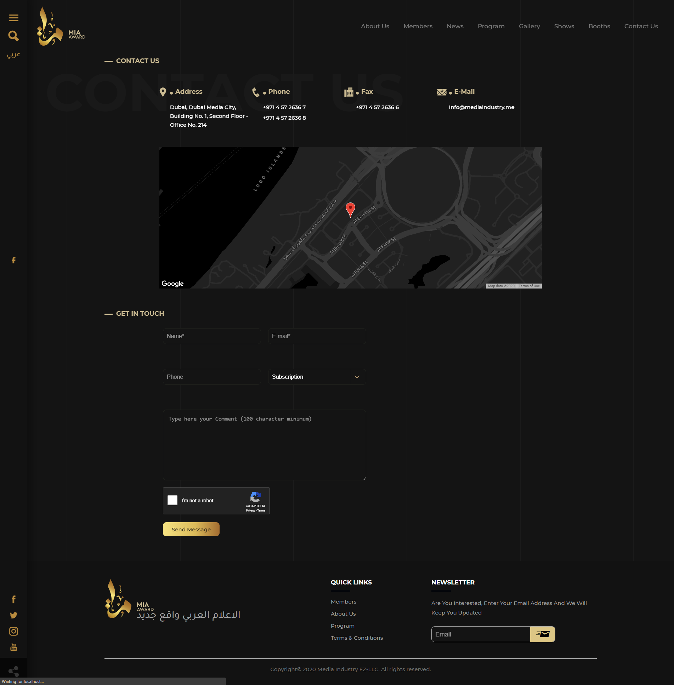

# MIA Awards

Portal that allow different media agencies to take part in MIA awards completion. Each award has a 2 winners.

### Modules ####

* Website (Reach Js, .NET Core)
* Dashboard & Admin (Angular Js, .NET Core)

